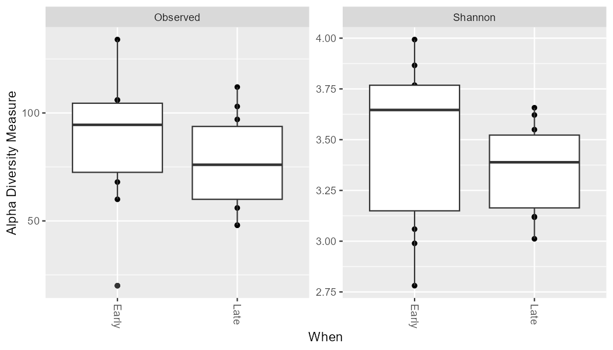

# 16S Microbiome Diversity

Profiling microbial communities from 16S rRNA amplicon reads — denoising to ASVs, assigning taxonomy, and
comparing diversity between groups — done twice: **R (dada2 + phyloseq + vegan)** and **QIIME2**.

## Research question

Does microbial community composition and diversity differ between groups? Two classic teaching datasets:
the **R** pipeline uses the dada2 tutorial data (**MiSeq SOP**, mouse gut, Early vs Late timepoints); the
**QIIME2** pipeline uses **Moving Pictures** (human body sites: gut, tongue, palms).

## Biological background

The **16S rRNA gene** is universal to bacteria/archaea and alternates **conserved** regions (universal PCR
primer sites) with **hypervariable** regions (taxon-identifying), so sequencing one variable region profiles a
whole community without culturing. Reads are denoised into **ASVs** (Amplicon Sequence Variants — exact
sequences, single-nucleotide resolution, the modern replacement for 97% OTUs). 16S count data are
**compositional** (only relative abundances are meaningful), which shapes every downstream choice.

Diversity is measured two ways: **alpha** (within a sample — Shannon, Faith's PD) and **beta** (between samples
— Bray-Curtis, and phylogeny-aware UniFrac). **PCoA** projects the between-sample distances to 2-D to see group
structure; **PERMANOVA** tests whether group centroids differ (R² = variance explained, permutation p-value).

## Methods

Reads → quality filter → **DADA2** denoise (ASVs) → assign taxonomy (SILVA) → build tree → **alpha** &
**beta** diversity → **PCoA** + **PERMANOVA** → taxonomic composition.

| Stage | R (dada2 + phyloseq) | QIIME2 |
|---|---|---|
| Denoise | `dada2::dada` | `qiime dada2 denoise-single` |
| Taxonomy | `assignTaxonomy` (SILVA) | `classify-consensus-vsearch` (SILVA 515F/806R) |
| Alpha | Shannon (`estimate_richness`) | Shannon + **Faith's PD** (`core-metrics-phylogenetic`) |
| Beta | Bray-Curtis (`ordinate`, PCoA) | Bray-Curtis + **UniFrac** (phylogeny-aware) |
| Test | `vegan::adonis2` (PERMANOVA) | `beta-group-significance` (PERMANOVA) |

The two are complementary: R shows the abundance-based metrics; QIIME2 adds the phylogeny-aware ones
(UniFrac, Faith's PD) via the ASV tree.

## Key result

Communities separate by group on the **PCoA**, with a significant **PERMANOVA** — body site (QIIME2) /
timepoint (R) is a strong ecological filter that structures the microbiome. (Fill in your own λ/PERMANOVA
numbers after running.)




## Interpretation

A clear group separation on the PCoA plus a significant PERMANOVA means the grouping variable explains a real,
non-random share of community variation — habitats select characteristic communities. The taxonomic barplot
names the **biomarker taxa** distinguishing each group. Because the data are compositional and 16S resolves
only to ~genus, this describes *who is there and how communities differ*, not *what they do* — that needs
shotgun metagenomics.

## Limitations

Compositional data; 16S → genus, not species or function; teaching-scale sample sizes; PERMANOVA can confound a
location shift with a dispersion difference (check with `betadisper`); one reference database. Rigorous next
steps: shotgun metagenomics for function, and a machine-learning classifier for biomarker discovery.

## Repository

```
microbiome_16s.R          # R pipeline (dada2 + phyloseq + vegan), MiSeq SOP
microbiome_16s_qiime2.sh  # QIIME2 pipeline, Moving Pictures (run in Linux/WSL)
results_R/                # alpha_diversity.png/csv, pcoa.png, permanova.txt
results_q/                # asv_table.tsv (+ .qzv visualizations open at view.qiime2.org)
```

## Run

**R (RStudio):** open `microbiome_16s.R`, set working dir to file location, source it. Installs dada2/phyloseq/
vegan and downloads the reads + SILVA on first run.

**QIIME2 (Linux/WSL):** install the QIIME2 amplicon distribution, `conda activate qiime2`, then
`bash microbiome_16s_qiime2.sh`. Open the `.qzv` outputs at https://view.qiime2.org.
