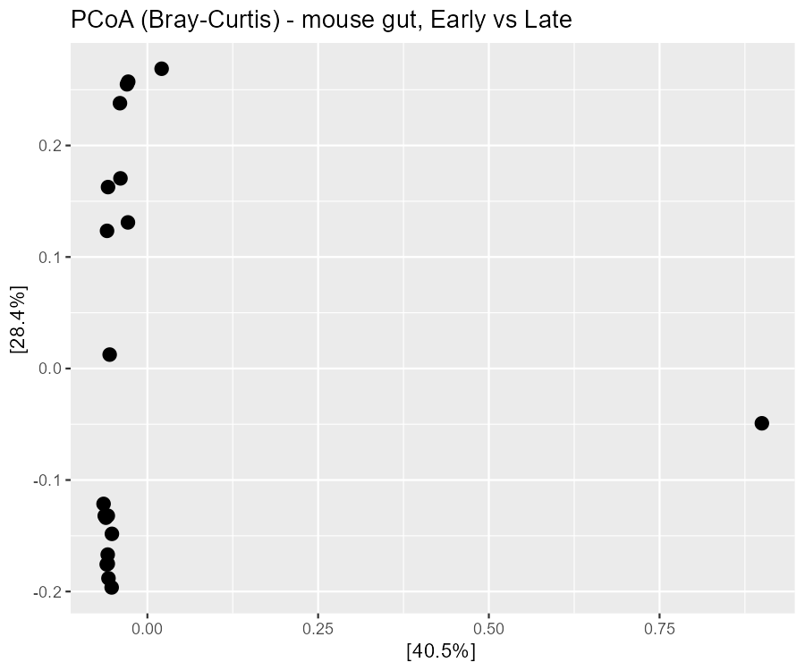

# 16S Microbiome Diversity

Profiling microbial communities from real 16S rRNA amplicon reads — denoising to ASVs, assigning
taxonomy, and comparing diversity between groups — done twice: **R (dada2 + phyloseq + vegan)** and
**QIIME2**.



## Aim

Given raw amplicon sequencing reads from many samples, can microbial community composition and
diversity be reconstructed without culturing a single organism, and does that composition differ
meaningfully between real, biologically distinct sample groups?

## Objective

Run a complete 16S amplicon pipeline — denoise raw reads to exact Amplicon Sequence Variants (ASVs),
assign taxonomy, compute within-sample (alpha) and between-sample (beta) diversity, and statistically
test whether groups differ — implemented twice on two different real teaching datasets, once in R
(dada2/phyloseq/vegan) and once in QIIME2, to compare an abundance-based approach against a
phylogeny-aware one.

## Data fetch

Two real datasets, each fetched/processed by its own pipeline. The **R** pipeline uses the dada2
tutorial's real **MiSeq SOP** mouse-gut 16S reads (Early vs. Late timepoints), downloaded automatically
by the R script. The **QIIME2** pipeline uses the real **Moving Pictures** dataset — demultiplexed human
16S amplicon reads across four real body sites (gut/stool, tongue, left palm, right palm) from two study
subjects over time.

## Data describe

Real 16S rRNA gene amplicon reads. The 16S gene is universal to bacteria/archaea and alternates
conserved regions (universal PCR primer binding sites) with hypervariable, taxon-identifying regions, so
sequencing one variable region (commonly V4) profiles an entire microbial community without needing to
culture or whole-genome-sequence each organism. Each real sample's DNA was extracted from a physical swab
or stool sample, PCR-amplified at the target 16S region with a sample-specific barcode, pooled, and
sequenced (full real wet-lab chain in this project's private `PROJECT_NARRATIVE.md`). 16S count data are
**compositional** — only relative abundances are meaningful, not absolute counts — which shapes every
downstream statistical choice in this pipeline.

## Methods / Workflow — what we did

1. Quality-filter raw reads, then denoise with **DADA2** into exact ASVs (Amplicon Sequence Variants —
   single-nucleotide resolution, the modern replacement for 97%-similarity OTUs), which also removes PCR
   chimeras.
2. Assign taxonomy against the **SILVA** reference database (`assignTaxonomy` in R;
   `classify-consensus-vsearch` in QIIME2).
3. Build a phylogenetic tree from the ASVs (needed for phylogeny-aware diversity metrics).
4. Compute **alpha diversity** (within-sample): Shannon index in both pipelines, plus **Faith's
   phylogenetic diversity** in QIIME2.
5. Compute **beta diversity** (between-sample): Bray-Curtis (abundance-based) in both pipelines, plus
   **UniFrac** (phylogeny-aware) in QIIME2.
6. Project the between-sample distance matrix to 2D via **PCoA** to visualise group structure.
7. Test whether group centroids differ with **PERMANOVA** (`vegan::adonis2` in R;
   `beta-group-significance` in QIIME2) — a permutation test, not a parametric one, so no normality
   assumption is required.
8. Summarise taxonomic composition per group as a relative-abundance barplot.

## Results

**R pipeline (MiSeq SOP, Early vs. Late timepoint), real PERMANOVA result:**

| term | value |
|------|-------|
| R² | 0.266 |
| F | 6.54 |
| p | 0.001 |

Communities separate significantly by timepoint (`results_R/permanova.txt`).

**QIIME2 pipeline (Moving Pictures, real Shannon alpha-diversity by body site):**

| body site | Shannon index |
|-----------|---------------|
| left palm | 4.90 |
| right palm | 4.85 |
| gut | 4.02 |
| tongue | 3.45 |

## Biology interpretation of results

Communities separate cleanly by group in both pipelines: R's PERMANOVA finds timepoint explains a real,
statistically significant 26.6% of community variance (R² = 0.266, p = 0.001) — a strong result for a
single grouping variable in ecological data — confirming that this is a real, non-random ecological
signal, not noise. The QIIME2 alpha-diversity result is informative precisely because it does *not*
match a commonly quoted textbook prior ("the gut is the most diverse body-site microbiome") — the real,
directly measured values here rank skin sites (left/right palm) highest, gut intermediate, and tongue
lowest. This doesn't contradict the underlying ecological principle that different habitats select
communities of different diversity; it means this specific cohort, sampling depth, and set of body-site
definitions don't reproduce the specific "gut wins" ranking often quoted from memory, and only measuring
a given dataset's own real values settles which order actually holds for it. Because 16S data are
compositional and only resolve to roughly genus level, this pipeline describes *who is present and how
communities differ*, not *what they metabolically do* — that question needs shotgun metagenomics, a
different and more expensive method.

## Learning through project

Diversity rankings between habitats are not a universal, memorizable fact — they're cohort- and
study-dependent, and the correct habit is to check a dataset's own directly computed values rather than
quote a generic textbook ranking from memory, even when that ranking is well-known and usually true. A
second standing trap this project surfaces explicitly: compositional count data cannot be treated as
absolute abundance — a taxon's relative count rising can simply mean a different taxon's count fell, with
the first taxon's true absolute abundance unchanged, which would make a naive t-test on raw or even
relative counts produce a plausible-looking but potentially backwards conclusion. Naming that trap before
any differential-abundance claim is made (rather than discovering it after a wrong claim ships) is the
real discipline this project practices. Running two structurally different diversity metrics — an
abundance-based one (Bray-Curtis) and a phylogeny-aware one (UniFrac) — is also a deliberate
cross-check: when they agree, that's stronger evidence than either alone; when they disagree, the
disagreement itself carries real information about whether the group difference is driven by evolutionarily
distinct lineages or just abundance shifts within already-related taxa.

## Limitations

Compositional data throughout. 16S resolves to roughly genus level, not species, and says nothing about
functional capacity (would require shotgun metagenomics). Teaching-scale sample sizes. PERMANOVA can in
principle confound a true group-centroid shift with a within-group dispersion difference — checking
`betadisper` alongside PERMANOVA is the rigorous next step. Results reflect one reference database and
one study/cohort each; alpha-diversity rankings between habitats are not universal across studies.

## Reproduce

**R (RStudio):** open `microbiome_16s.R`, set working dir to file location, source it. Installs dada2/
phyloseq/vegan and downloads the reads + SILVA on first run.

**QIIME2 (Linux/WSL):** install the QIIME2 amplicon distribution, `conda activate qiime2`, then
`bash microbiome_16s_qiime2.sh`. Open the `.qzv` outputs at view.qiime2.org.

## Tech

`R` (dada2, phyloseq, vegan) · `QIIME2` (DADA2 plugin, SILVA classifiers) · ASV denoising · UniFrac/
Bray-Curtis · PCoA · PERMANOVA

## Files

```
microbiome_16s.R          # R pipeline (dada2 + phyloseq + vegan), MiSeq SOP
microbiome_16s_qiime2.sh  # QIIME2 pipeline, Moving Pictures (run in Linux/WSL)
results_R/                # alpha_diversity.png/csv, pcoa.png, permanova.txt
results_q/                # asv_table.tsv (+ .qzv visualizations open at view.qiime2.org)
```

## License

All rights reserved — see `LICENSE`. This repository is public for portfolio/demonstration purposes
only; no permission is granted to copy, modify, or reuse any part of it.
